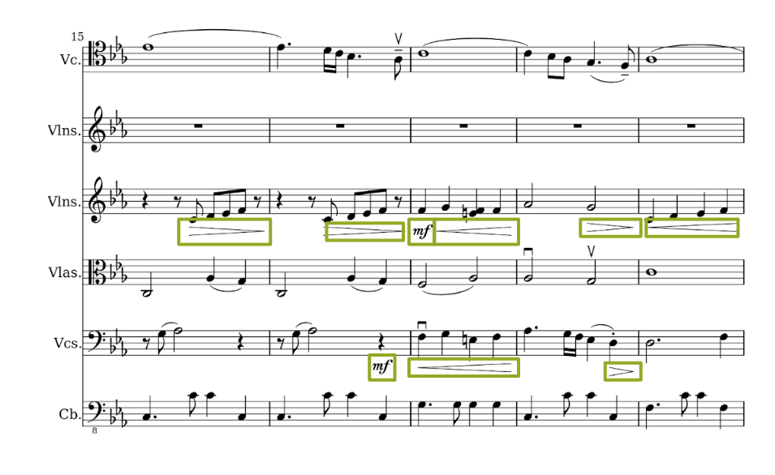
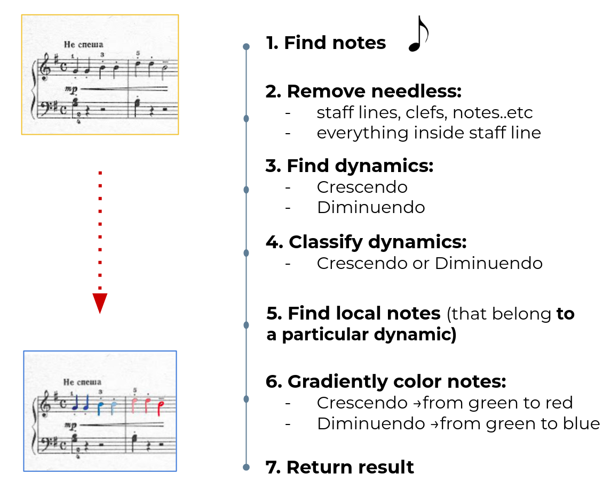
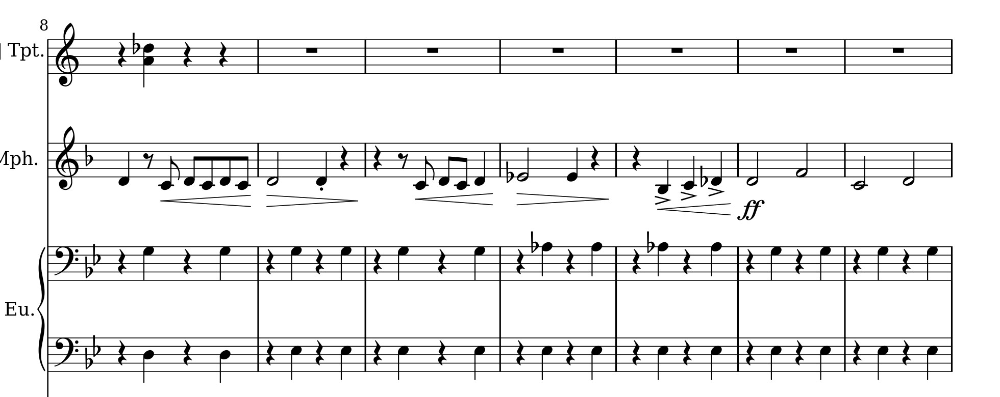
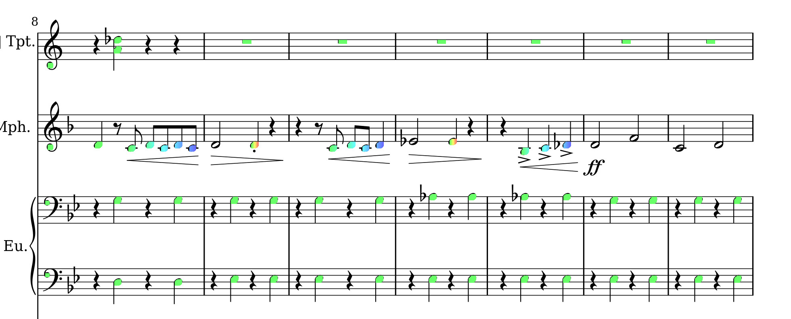

# Piano-Notes-Preprocessing
A script that colors piano sheets depending on sound intensity 

## Problem Description

When you first start learning to play the piano, there is a bunch of information to know and memorize. It’s really hard to understand which keys you should press and memorize what each sign means. But you still want to play nice music and impress your friends. We want to help beginners to read notes in more easy way by coloring notes with respect to the intensity of sound.

We have collected a custom dataset using a Google search piano sheet with symbols that describe the volume of a sound, and randomly choose the 5 images. In Fig.1 in grean boxes special symbols related to sounds intensity are shown.

<p align="center">
  
</p>
<p align="center">   
   <em> Fig.1 Example of image in train set.</em>
</p>

## Solution

Overall pipeline you can see in Fig.2.

<p align="center">
  
</p>
<p align="center">   
   <em> Fig.2 Pipeline </em>
</p>

To achieve the results, following techniques were used:
1. [Morphological Transformations ](https://docs.opencv.org/4.x/d9/d61/tutorial_py_morphological_ops.html)
2. GaussianBlur
3. [find Contours](https://docs.opencv.org/4.x/d4/d73/tutorial_py_contours_begin.html)
4. [Contour Features: Contour Area](https://docs.opencv.org/4.x/dd/d49/tutorial_py_contour_features.html)
5. [Contour Features: Contour Approximation](https://docs.opencv.org/4.x/dd/d49/tutorial_py_contour_features.html)
6. [Convex Hull](https://docs.opencv.org/3.4/d3/dc0/group__imgproc__shape.html#ga014b28e56cb8854c0de4a211cb2be656) - is the minimum boundary that can completely enclose or wrap the object(or contour of that object). A Convex Hull looks similar to contour approximation, but it is not exactly a contour approximation. A convex hull is a convex curve around an object.

## Result

To run succesfully script `color_notes.py`, do the following:
1. clone this repository:
```
git clone https://github.com/Allessyer/Piano-Notes-Preprocessing.git
```
2. go to the directory `Piano-Notes-Preprocessing`
```
cd Piano-Notes-Preprocessing
```
3. create conda environment
```
conda create --name piano_notes
```
4. activate conda environment
```
conda activate piano_notes
```
5. install dependencies
```
pip install -r requirements.txt
```
6. run `color_notes.py`
```
python color_notes.py
```
This script in the end will create `output` directory and put all processed images into it.

If you want to run on your own images, put them into one directory and put as an argument to the script path to this directory as:
```
python color_notes.py -path <PATH TO DIRECTORY OF YOUR IMAGES>
```


<p align="center">
  
</p>
<p align="center">
  <em> a. </em>
</p>
<p align="center">
  
</p>
<p align="center">
  <em> b. </em>
</p>
<p align="center">   
   <em> Fig.3. a. original image, b. preprocessed image.</em>
</p>


